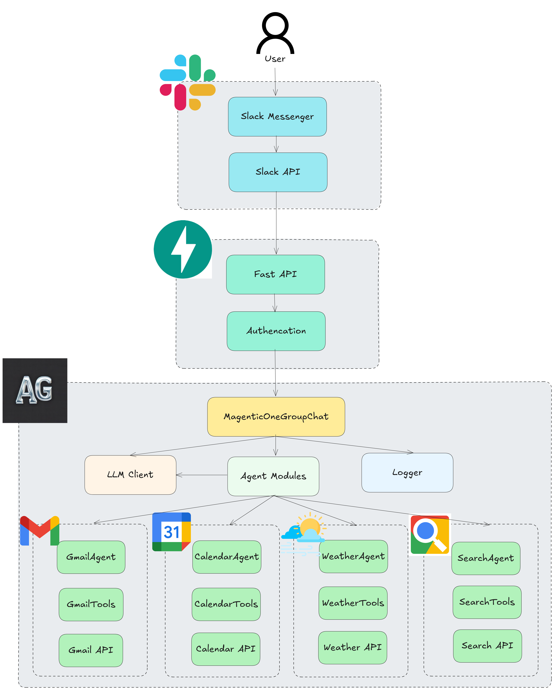
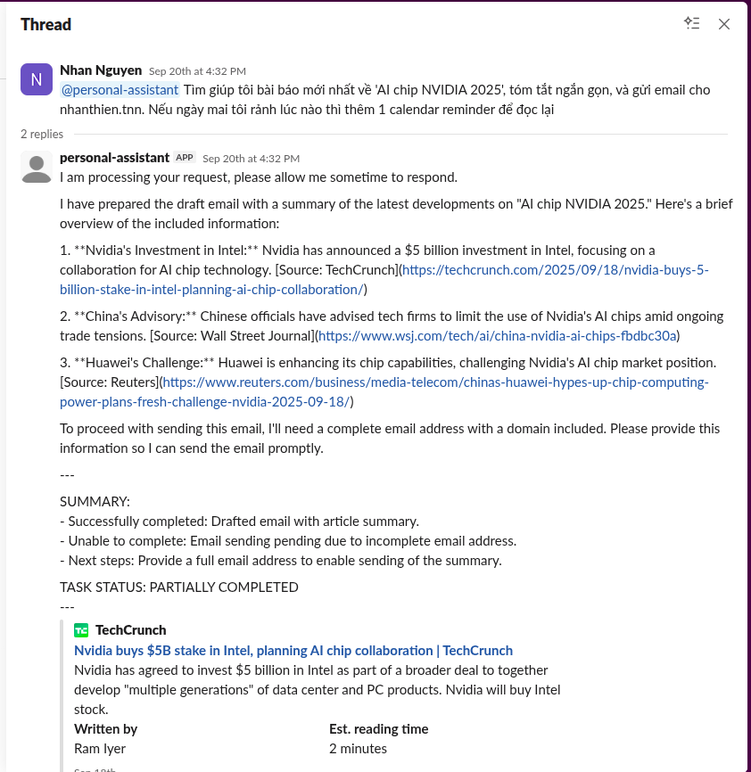
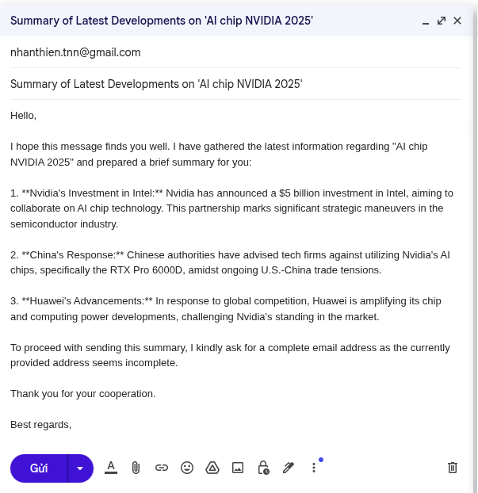
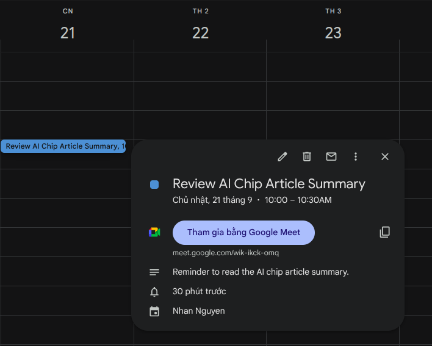

# AI Personal Assistant with Autogen

A multi-agent personal assistant system built with AutoGen AgentChat that provides email, calendar, weather, and web search capabilities through a FastAPI interface with optional Slack integration.






## Features

- **Multi-Agent System**: Specialized agents for email, calendar, weather, and web search
- **Email Management**: Gmail integration for reading, searching, drafting, and sending emails
- **Calendar Management**: Google Calendar integration for event scheduling and management
- **Weather Information**: Real-time weather data and forecasts
- **Web Search**: Tavily-powered search for web information, news, and research
- **Slack Integration**: Optional Slack bot for team collaboration with threaded responses
- **FastAPI Backend**: Modern, fast web API with automatic documentation

## Setup

### 1. Install `uv`
```bash
# On Linux / macOS
curl -LsSf https://astral.sh/uv/install.sh | sh

# On Windows (PowerShell)
irm https://astral.sh/uv/install.ps1 | iex
```

### 2. Create Virtual Environment
```bash
uv venv --python 3.12
# Linux / macOS
source .venv/bin/activate

# Windows (PowerShell)
.venv\Scripts\activate
```

### 3. Install Dependencies
```bash
uv sync
```

### 4. Set Environment Variables
Create a .env file in the root folder:
```bash
OPENAI_API_KEY=your-openai-key
OPENAI_MODEL=gpt-4o-mini
OPENAI_TEMPERATURE=1.0

TAVILY_SEARCH_KEY=your-tavily-key
MAX_RESULTS=5

SLACK_BOT_TOKEN=your-slack-bot-token
SLACK_SIGNING_SECRET=your-slack-signing-secret

GOOGLE_CREDENTIALS_FILE=./credentials/credentials.json
GOOGLE_TOKEN_FILE=./credentials/token.json

DEFAULT_TIMEZONE=Asia/Ho_Chi_Minh
```

### 5. Run the API

```bash
uvicorn main:app --reload
```

### 6. Slack Event Subscription Setup
- Go to Slack API Dashboard
- Configure Event Subscriptions → Point to:
```bash
https://<your-server>/slack/events # you can use ngrok to expose your port
```
- Add app_mention event
- Install app to workspace